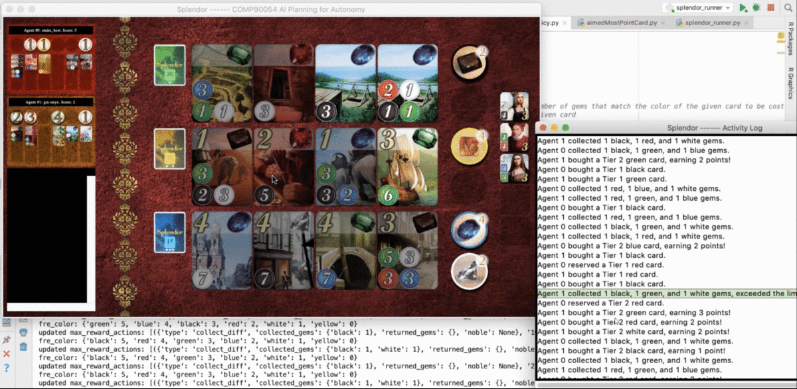
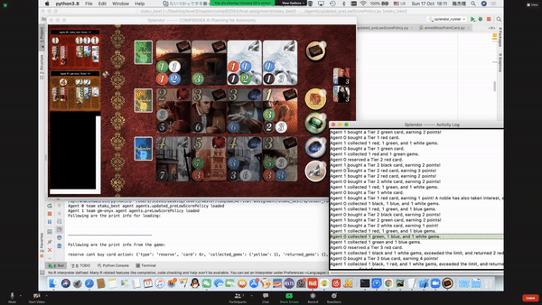
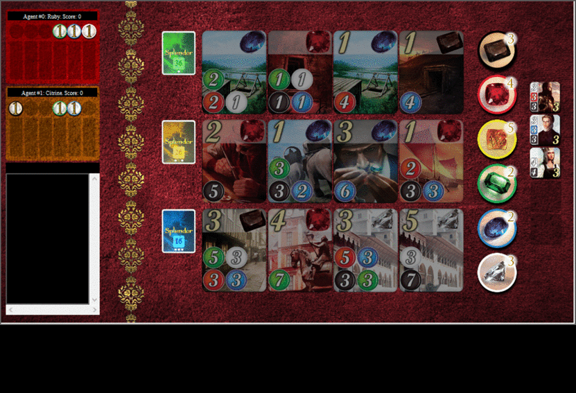

# Evolution of the approach

----
## 1. First Agent - MDPs with the Value Iteration
----
In total, we have three different strategies. we have nam them as: "Large-Point", "Naive Small-Point" and "Smart Small-Point". 
Generally speaking, the "Large-Point" agent aims those cards with 4 points or five points as the target. The main strategy here 
is to use designed reservation as a main action to win the reward. The "Naive Small-Point" simply aims to buy affordable cards without
a lot of strategies. The "Smart Small-Point", based on the "Naive Small-Point", have the smartest performance with well-designed 
policies. Details are described as follows.

### Large-Point
This agent's strategy was inspired from different forums. The splendor, as a popular table game, has many forums for 
players to share their strategies. Many people suggested that they targeted on cards on the third dealt for the given 
version of splendor. We used this idea as the basic idea.

In detail, the "Large-Point" agent's macro idea is to reserve one of high value cards at the third round. The high value cards 
are defined as cards with the most points. For cards with the same points, we choose the one has the least colors required
for gems or cards to buy. After the third round reservation, we aim to buy cards with the colours which can buy this reserved 
cards. Those cards are called required cards.
### 3-rd turn reserve


The technique for buying required cards are:
```angular2html
a. The highest score has the highest priority.
b. If we can buy a card with higher point(s) than current round affordable cards' in no more than 2 rounds, we will choose to collect gems to buy that card with higher score. But it is a design flaw which may make unwise decision.
c. If the required card needed gems - all gems and wilds we have is no more than 2 ( 2 rounds to the most to get the card), which means we can buy it at the next round, we will reserve this card.
```
### A reserve logical bug


In this gif, we show a design flaw of the technique b. Agent can directly buy the card by collecting a black gem, but it chose to reserve
it then buy with two wilds. This flaw is later on fixed and used in the "Smart Small-Point".

This strategy has the following advantages:
```angular2html
a. When there are many required cards on the board, it is quite quick to beat the counter agent.
b. In this way, we have fewer cards than others.
```

This strategy was used from 10.01 to 10.04. The rank, ranging from 19 to 31, is not ideal. After observed records,
we concluded its disadvantages:
```angular2html
a. When there are few required cards on the board, it is hard to buy the reserved card. As a consequence, we will lose.
b. We ignore nobles totally and this flaw was found by inspecting replay with our approximate Q learning agent.
c. The winning is dependent on luck, which means bad generalization.
d. The technique c is not smart, sometimes it will tend to reserve cards with no point. It is a design logical bug.
```

#### Best competition results: Position - 1/2 | Percentile - 50%


#### Strategy summary

| Pros | Cons |
|-----------------|:-------------|
| Win fast | Luck dependent |
| Few cards | No consideration on nobles |
| - | Few required cards lead to lose for the most cases |

### Naive Small-Point
This strategy was inspired from the game replay with other agents. We found that, compared to ours, other agents mostly 
have more interests on the cards with small points or even with no point, especially in the early stage. We have discussed 
this phenomenon and have more research on forums. We have a possible explanation that many human players suggest collecting
required cards to buy high points card. However, human can always choose optimal or almost optimal action for each round.
This strategy is reasonable for human, but it is too long from the initial state for agent. Thus, we decided to try this strategy.
At the very beginning, this strategy aims to take any affordable cards and return unimportant gems if we have over 10 gems. 
We used this to play with the first strategy and it has 60% winning rate.

At the next day, we had an excellent reward: our rank became the second one out of 80 counters. Although at this stage, 
many teams may not have a well-designed agent, it still indicates that this strategy is better than the "Large-Point". 
Then we take nobles into consideration. Our agent will buy cards with colours which are all nobles need. After several iteration, we have the following policies:
```angular2html
a.  Buy affordable cards.
b.  We set card priority as: with colours that nobles need then the card with points as well as least round to get.
c.  Collect cards with colours that nobles required.
d.  To save collect gems chance, we optimize the decision of gems. For example, if we find we have only three round to
    buy a card with 3 black 3 white and 2 blue gems at the opening. We will collect white, black and blue for two rounds.
    But for the last round, we will take white and black and other colours gems which is the rarest on board.
```
We have concluded advantages of this strategy as followings:
```angular2html
a.  Buying cards with small or no point is not only good for building points directly, it can also help to get more cards in the late stage of the game.
b.  We take nobles into consideration.
c.  Better generalization so that higher winning rate
```
However, this strategy is still naive. As other teams make improvement, its performance sometimes dropped to rank 26.
We make an inspection and find the following flaws:
```angular2html
a.  The nobles are not considered smart enough. Our agent is so greed that hopes to invite all of them. If the counter use noble-based
    strategy, we cannot win usually.
b.  Better generalization, but worse specification. We have met an agent take one colour gem and card and never return. This makes us harder to beat it.
```
#### Best competition results: Position - 1/40 | Percentile - 0.025%


#### Strategy summary

| Pros | Cons |
|-----------------|:-------------|
| Build advantages gradually | Worse specification |
| Nobles considered | Not comprehensive |
| Better generalization | - |

### Smart Small-Point
This strategy is an optimized version of the previous one. We have keep optimizing it and makes some remarkable improvement:
```angular2html
a.  We have optimized strategy to decide choosing cards with small points to invite a noble or buy cards on the second dealt.
    1. We will calculate maximum overlapped colours of nobles each by each at the beginning. Only if no smaller than two colours in common we will choose noble strategy.
    2. For noble, we will choose to invite the one with the least cards needed.
b. The colours priority are calculated as:
    1. The colour has the least differences to invite the chosen noble.
    2. The needed colours for buying a target card on the second dealt.
    3. The colour needed by other two nobles.
    4. The most needed colours by all cards on board.
    5. The left colour.
c.  We will collect each colour gem at least one time in case that specific agent interrupt our agent.
d.  We also reserve cards if we can buy it at next round. But, only if there are no gems this card required on board and it has no less than 3 points will we reserve it.
e.  We add defense policy:
    1.  At the middle stage, we will reserve cards with no smaller than 3 points and it is the only card which the counter agent can get at its turn.
    2.  At the final stage, even if we can win this turn, the counter can win at its turn by buying and can only win by this card, we will reserve it in case that
        we have smaller check-out points to lose the game.
f.  For technique d of the "Naive Small-Point", we change to replace the rarest gems on board to the rarest gems in agent hands.
```
This modification receives satisfying response as well. It reached the third place on 10.17.

This agent, based on the "Naive Small-Point" agent, is the best agent we can develop currently. Its advantages, besides those from the
"Naive Small-Point" agent, are:
```angular2html
a.  Better policy of choosing noble or cards with small points strategy.
b.  Completed consideration on corner cases.
c.  Compared to the "Large-Point" agent, it has shorter path from the initial state. The local optimal is always easier for
    computer to draw than global optimal.
```
#### An overturn winning


This gif shows how our new reserve policy help us to gain an overturn win. We were about to lose if we take no effective actions
to prevent the counter agent to take the card with five points. According to our policy e.2., we choose to reserve this card. This help us delay the counter's winning round and have an overturn win.

#### Best competition results: Position - 1/40 | Percentile - 0.036%


#### History rank evolution:

| Informal Match | Rank | Strategy|
|-----------------|:-------------|:-------------|
| 10.01 3:00 | 19 | "Large-Point"|
| 10.01 14:00 | 25 | "Large-Point"|
| 10.02 3:00 | 31 | "Large-Point"|
| 10.03 14:00 | 20 | "Large-Point"|
| 10.05 3:00 | 2 | "Naive Small-Point"|
| 10.06 3:00 | 21 | "Naive Small-Point"|
| 10.06 14:00 | 5 | "Naive Small-Point"|
| 10.09 3:00 | 19 | "Naive Small-Point"|
| 10.09 14:00 | 16 | "Naive Small-Point"|
| 10.10 14:00 | 26 | "Naive Small-Point"|
| 10.11 3:00 | 5 | "Smart Small-Point"|
| 10.13 3:00 | 5 | "Smart Small-Point"|
| 10.13 14:00 | 19 | "Smart Small-Point"|
| 10.16 14:00 | 12 | "Smart Small-Point"|
| 10.17 3:00 | 3 | "Smart Small-Point"|
| 10.17 14:00 | 17 | "Smart Small-Point"|
| 10.18 3:00 | 27 | "Smart Small-Point"|

----
## Second Agent - Approximate Q learning
----

This agent, as we planned, is to give us different insight on strategy evolution. We trained the model with the random at first.
Since the random agent does not have any strategy, our model has only about 5% winning rate with the "Large-Point" value iteration
agent. Thus, we decide to train the agent with the "Large-Point" agent. After training and watching the replay, we found a
design flaw of the "Large-Point" agent. In the gif below, we found that our "Large-Point" agent, 
which is Agent#1 did not consider noble and lose because of that. But the approximate Q learning had developed a noble
action and invite two to win. After training the winning rate of approximate Q learning agent has 20% winning rate with the
"Large-Point" agent.

#### "Large-Point" Lost for ignoring noble


It is the most useful insight the approximate Q learning gives to us.


----
## Comparison of two techniques
----

| Attributes | Value iteration | Approximate Q learning |
|-----------------|:-----------------|:-------------|
| Policy | "Large-Point", "Naive Small-point", "Smart Small-Point" | None |
| Whether over the time limit | No | No |
| train | No | Yes |
|Winning rate | 95% - 80% | 5% - 20% |
